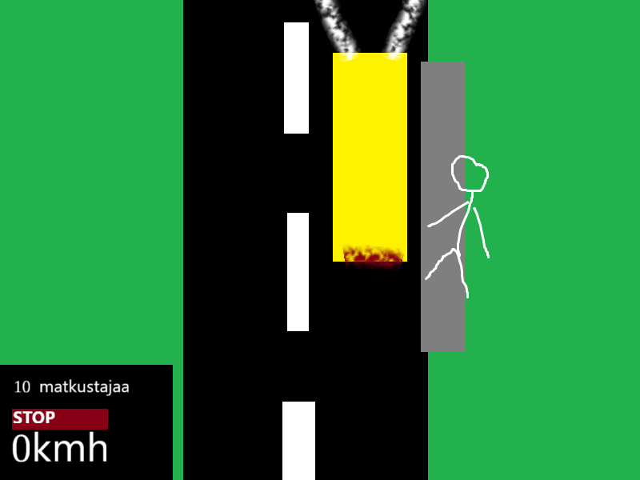

# Harjoitustyön suunnitelma

(Täydennä oman pelisi tiedot tähän tiedostoon muokkaamalla 
tiedostoa tekstieditorissa. Käytä [Markdown-syntaksia](https://about.gitlab.com/handbook/markdown-guide/).
Poista sitten *kaikki* suluilla merkityt kohdat.)

## Tietoja 

Tekijä: Onni Nevala

Työ git-varaston osoite: https://github.com/ctih1/harjoitustyo-1
Pelin nimi: Koivuranta simulaattori 2025

Pelialusta: Windows

Pelaajien lukumäärä: 1

## Pelin tarina

Pelissä ajetaan bussilla ja otetaan matkustajia pysäkeiltä. Bussin pitää pysyä aikataulussa, jotta pelaaja saisit täydet pisteet. Pelaajan pitää myös noudattaa liikennesääntöjä, ja hallita bussin sisäisiä tapahtumia.

## Pelin idea ja tavoitteet

Pelin idea on ajaa bussilla ympäri satunnaisesti luotua karttaa, ja kerätä pisteitä tekemällä erilaisia tehtäviä

## Hahmotelma pelistä

## Toteutuksen suunnitelma

Helmikuu

- (Tavoite 1)
- (Tavoite 2)
- (Tavoite 3)

Maaliskuu

- (Tavoite 1)
- (Tavoite 2)
- (Tavoite 3)

Jos aikaa jää

- (Tavoite 1)
- (Tavoite 2)
- (Tavoite 3)
